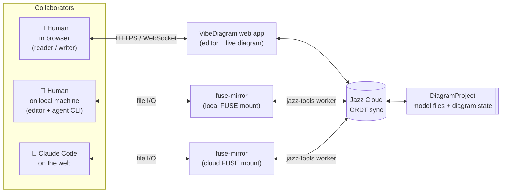

# VibeDiagram

A browser-based tool for building and visualizing discrete-event simulations. Write TypeScript simulation code in an in-browser editor, and see it rendered as an interactive node-edge diagram — all client-side.

**Try it live:** [vibediagram-public.vercel.app/projects](https://vibediagram-public.vercel.app/projects)

For architecture and maintenance details, see [ARCHITECTURE.md](./ARCHITECTURE.md).

## Collaborate from anywhere

A VibeDiagram project lives in [Jazz](https://jazz.tools), a local-first CRDT database that syncs through Jazz Cloud. That single source of truth lets humans and agents work on the same project from three different surfaces — concurrently, with live updates between them:

- **In the browser** — open the web app, get reader or writer access, and edit the model with the in-browser editor while the diagram updates live.
- **In your own editor** — mount the project as a local filesystem with [`fuse-mirror`](packages/fuse-mirror/README.md) and edit files in VS Code, Neovim, or drive an agent CLI (Claude Code, Codex, …) over the same mount.
- **With Claude Code on the web** — point a cloud Claude Code session at a fuse-mirror mount of the project; Claude edits the same files, with results visible immediately in any open browser tab.



Permissions are managed per project from the **Shared Access** dialog in the browser app. Grant a person or a fuse-mirror worker account either the `reader` or `writer` role; everything else flows from that.

## Getting Started

### Prerequisites

- Node.js 22+ (latest LTS)
- pnpm 8+

### Installation

```bash
pnpm install
```

### Development

Start the development server:

```bash
pnpm dev
```

This starts the Vite development server at `http://localhost:3000`.

### FUSE mount (optional)

Mount a Jazz project as a local filesystem for editing in any text editor. Requires FUSE support (`fuse3` + `libfuse-dev` on Linux, macFUSE on macOS).

```bash
# Create Jazz worker credentials (one-time)
npx jazz-run account create --name "fuse-mirror"

# Mount a project
JAZZ_WORKER_ACCOUNT=<id> JAZZ_WORKER_SECRET=<secret> \
  npx tsx packages/fuse-mirror/src/cli.ts <project-id>
```

See [packages/fuse-mirror/README.md](packages/fuse-mirror/README.md) for details.

### Deployment

```bash
pnpm build      # Build for production
pnpm deploy     # Deploy to Vercel
```

## Dev Container

A sandboxed dev container is available for running Claude Code with network and filesystem isolation. See [`.devcontainer/README.md`](.devcontainer/README.md) for setup instructions.

## License

MIT
